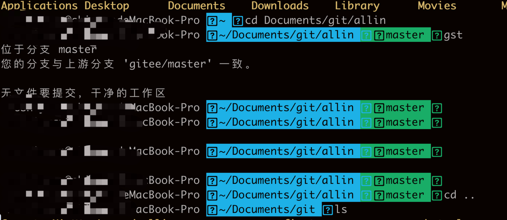
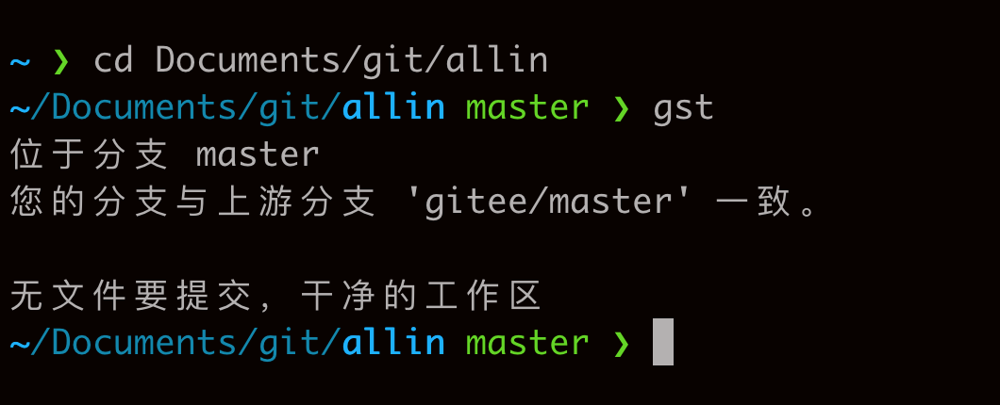

# 背景
优雅耐看的终端工具，必是每个程序员的追求。
本人也不例外，从业几年先后使用过：
1. windows电脑：cmd、git bash、wsl + zsh、terminal + zsh
2. Mac电脑: 自带terminal、iTerm2、terminal + zsh

其中windows terminal + zsh、mac terminal + zsh这两套是我windows、mac分别正在使用的组合，已经算是很美观、优雅了。

但追求永无止境！

本次使用 iTerm2 + zsh组合，打造更优雅客户端。

# 方案选型
有很多优秀的终端美化工具供Mac用户选择，下面是一些推荐的工具：

1. iTerm2

    iTerm2 是一个 MacOS 端的终端模拟器，它包括了许多实用的特性，例如窗口分割、全屏、透明度、资源占用查看、自定义热键能力等。它是开源软件，大家可以免费使用。

2. Zsh

    Zsh 是一个强大的 shell，可以作为 bash 的替代品。它包含许多功能，如自动补全、命令修复和模式匹配，这些功能可以帮助提高你的效率。

3. Oh My Zsh

    Oh My Zsh 是一个管理 zsh 配置的开源框架，它具有丰富的插件和主题，使得命令行工作变得更加愉快。

4. Hyper

    Hyper 是一款开源的命令行工具，提供优美的用户界面和强大的扩展功能。

5. Fish Shell

    Fish Shell 是一款智能的命令行 shell，拥有自动建议和深度集成嵌入式的帮助信息。

6. Powerlevel10k
    Powerlevel10k 是 Zsh 主题，它强调速度、灵活性和易用性，可以显示丰富有用的信息，而且非常美观。

使用这些工具可以让你的终端环境变得更美观，同时也能提高你的工作效率。

# 安装iTerm2

## 方法一：

可以从它的官网上直接下载。并将其拖放到你的应用程序文件夹中进行安装。

## 方法二：
使用 Homebrew cask 命令安装：

> brew install --cask iterm2

# 安装Oh My Zsh

Oh My Zsh是一个帮助你管理你的Zsh配置的开源框架，提供了很多插件，主题等可以进行选择。

在iTerm2中输入下面命令来安装Oh My Zsh（在提示中选择“y”）：

> sh -c "$(curl -fsSL https://raw.github.com/ohmyzsh/ohmyzsh/master/tools/install.sh)"

安装并切换主题：在Oh My Zsh的主题目录下，你可以找到很多主题进行选择。比如，`agnoster`主题。

> vim ~/.zshrc

找到 ZSH_THEME 这一行，将 "robbyrussell" 替换为 "agnoster"

  

# powerlevel10k
安装并启用powerlevel10k：这是一个用于Zsh的主题，它强大而又快速。对于agnoster主题的用户来说，它是一个很好的备选。

> git clone --depth=1 https://github.com/romkatv/powerlevel10k.git ${ZSH_CUSTOM:-$HOME/.oh-my-zsh/custom}/themes/powerlevel10k

> vim ~/.zshrc

找到 ZSH_THEME 这一行，将 "agnoster" 替换为 "powerlevel10k/powerlevel10k"

成品如下图：
  

以上构建的最终效果图，有点差强人意，没有达到心中目标，后续慢慢补强！